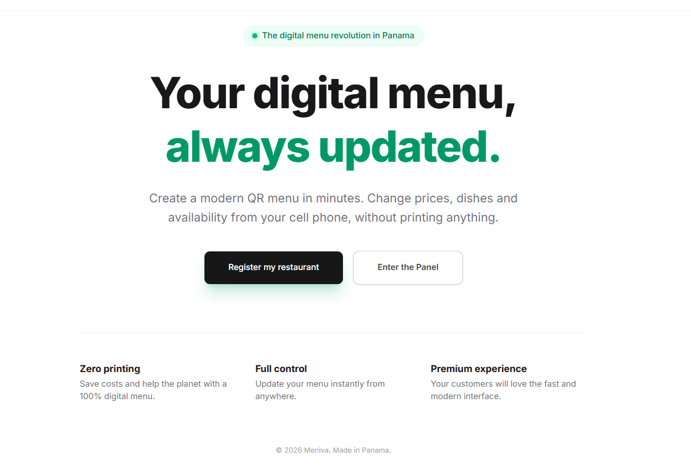
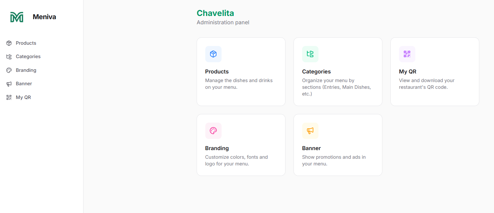
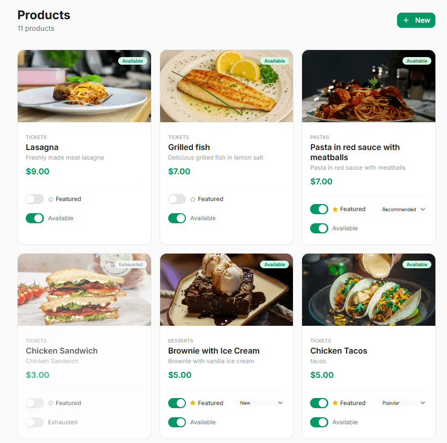
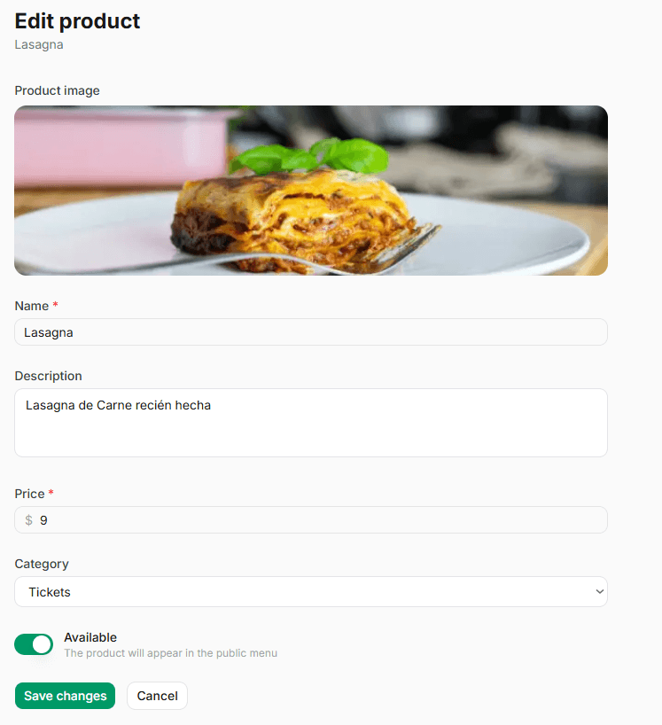
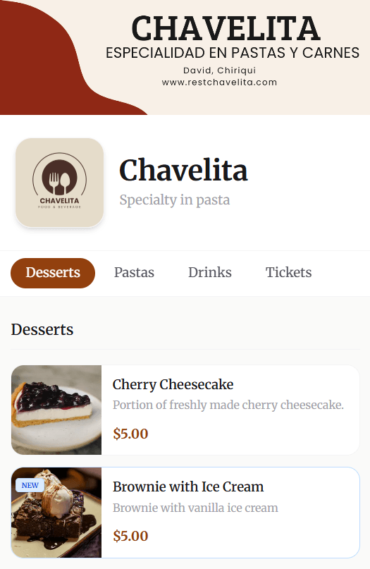
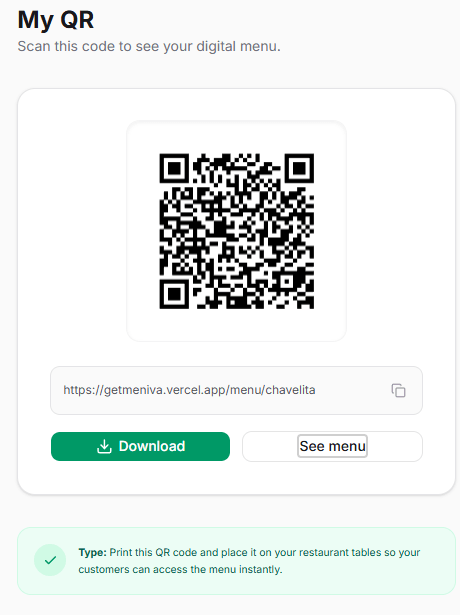

# 🍽️ Meniva

> A modern digital menu platform that helps restaurants and food businesses manage and publish their menus in real time.

<p align="center">
  <a href="https://getmeniva.vercel.app/" target="_blank">
    
  </a>
</p>

<p align="center">
  
  
  
  
  
  
</p>

---

## 📖 Overview

Meniva is a digital menu platform designed to replace traditional printed menus with a modern, easy-to-manage solution.

Restaurant owners can update dishes, prices, images, and categories instantly through an intuitive administration dashboard, while customers simply scan a QR code to access the latest version of the menu from any device.

---

## 🚀 The Problem

Many restaurants still rely on printed menus, making updates slow, expensive, and inconvenient.

Every price change, new dish, or promotional offer often requires printing new menus, increasing operational costs and delaying updates.

Meniva solves this by allowing businesses to publish changes instantly, ensuring customers always have access to the most up-to-date menu.

---

## ✨ Features

### 👨‍💼 Admin Dashboard

- Create, edit, and delete menu categories
- Create, edit, and delete products
- Upload product images
- Update prices instantly
- Enable or disable products
- Generate QR codes
- Customize branding colors
- Manage multiple restaurant locations

### 👥 Customer Experience

- Scan a QR code to access the menu
- Browse products by category
- Search menu items
- Fast and responsive interface
- Optimized for mobile devices

---

## 👥 Who Is It For?

Meniva is designed for businesses that need a flexible digital menu solution, including:

- 🍽️ Restaurants
- ☕ Coffee Shops
- 🚚 Food Trucks
- 🍸 Bars
- 🥗 Cafés
- 🏪 Any business with a digital menu

---

## 🛠️ Tech Stack

### Frontend

- Next.js 15 (App Router)
- TypeScript
- Tailwind CSS
- Lucide React
- browser-image-compression
- qrcode.react

### Backend

- Supabase
- PostgreSQL
- Supabase Authentication
- Supabase Storage

### Deployment

- Vercel
- GitHub

---

## 🔐 Authentication

Authentication is powered by **Supabase Auth**, providing secure access to the administration dashboard.

---

## 🗄️ Database

Meniva uses **PostgreSQL** through Supabase.

### Main Tables

| Table | Description |
|--------|-------------|
| `restaurants` | Stores restaurant information |
| `categories` | Stores menu categories |
| `products` | Stores menu products |
| `auth.users` | Authentication managed by Supabase |

---

## 📱 Responsive Design

The application is fully responsive and optimized for:

- 💻 Desktop
- 📱 Mobile
- 📲 Tablet

---

## 📂 Project Structure

```text
app/
(auth)/
(dashboard)/
actions/
menu/
components/
docs/
lib/
public/
types/
```

---

## 📸 Screenshots

**Note:** The screenshots feature a fictional Spanish-speaking restaurant created for demonstration purposes. Meniva supports customizable branding and can be localized for different languages.


### Landing Page



---

### Dashboard



---

### Product Management



---

### Product Editor



---

### Customer Menu



---

### QR Code



## 🚀 Getting Started

Clone the repository:

```bash
git clone https://github.com/joseafg94/meniva.git
```

Go to the project directory:

```bash
cd meniva
```

Install dependencies:

```bash
npm install
```

Create a `.env.local` file and add your Supabase credentials:

```env
NEXT_PUBLIC_SUPABASE_URL=your_supabase_url
NEXT_PUBLIC_SUPABASE_ANON_KEY=your_supabase_anon_key
```

Run the development server:

```bash
npm run dev
```

Open your browser at:

```
http://localhost:3000
```

---

## 🎯 Future Improvements

- User management
- Multi-language support
- Customer reviews
- Analytics dashboard
- Online ordering
- Payment integration

---

## 🤝 Contributing

Contributions, suggestions, and feedback are always welcome.

If you'd like to improve Meniva, feel free to fork the repository and submit a pull request.

---

## 📄 License

This project is licensed under the MIT License.

---

## 👨‍💻 Author

**Jose Fuentes**

- 💼 LinkedIn: https://www.linkedin.com/in/jose-fuentes-208972379/
- 📧 Email: jfuentesg09@gmail.com

---


